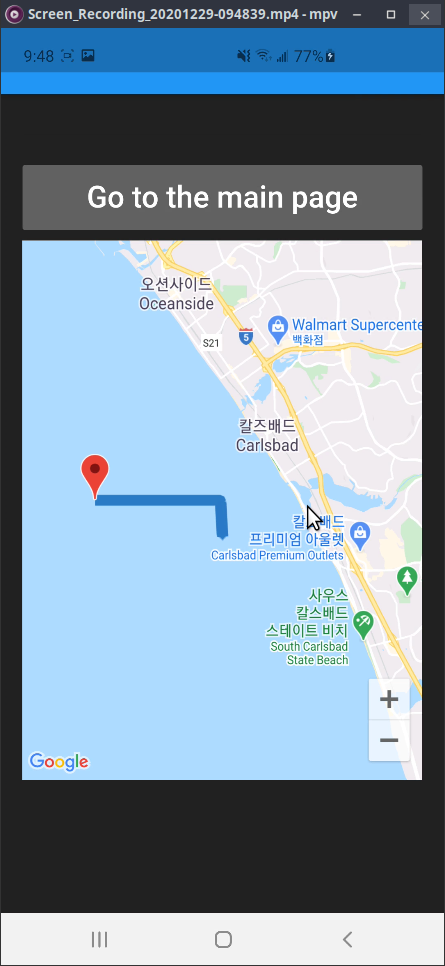

# Flutter Google-maps package evaluation

This is a rough trial of using the Google maps package (Gmap) based on [this blog post](https://medium.com/flutter-community/drawing-route-lines-on-google-maps-between-two-locations-in-flutter-4d351733ccbe) and the example in this repo shows Gmap widget and custom lines on the screen as below.

 

 

## References

- Basics of GPS system and notation
    - https://en.wikipedia.org/wiki/Geographic_coordinate_system
    - https://en.wikipedia.org/wiki/Geotagging#Photographs
    - https://docs.mapbox.com/help/glossary/lat-lon/#:~:text=Latitude%20and%20longitude%20are%20a,180%20to%20180%20for%20longitude.
- How to enable Gmap APIs and Gmap package
    - https://developers.google.com/maps/gmp-get-started
    - https://support.google.com/maps/answer/18539?co=GENIE.Platform%3DDesktop&hl=en (DMS, DMM or DD?)
    - https://pub.dev/packages/google_maps_flutter
    - https://github.com/flutter/plugins
- Some blog posts
    - Gmap usage: https://medium.com/flutter/google-maps-and-flutter-cfb330f9a245
    - Maker on Gmap: https://github.com/flutter/plugins/blob/master/packages/google_maps_flutter/google_maps_flutter/example/lib/place_marker.dart
    - :star2: Line on Gmap: https://medium.com/flutter-community/drawing-route-lines-on-google-maps-between-two-locations-in-flutter-4d351733ccbe
- Useful web services
    - Unix time converter: https://www.epochconverter.com/hex
    - Reverse geocoding: https://developers.google.com/maps/documentation/javascript/examples/geocoding-reverse

## Tips

Change "minSdkVersion 16" to "minSdkVersion 24" in android/app/build.gradle for the Gmap package. 
